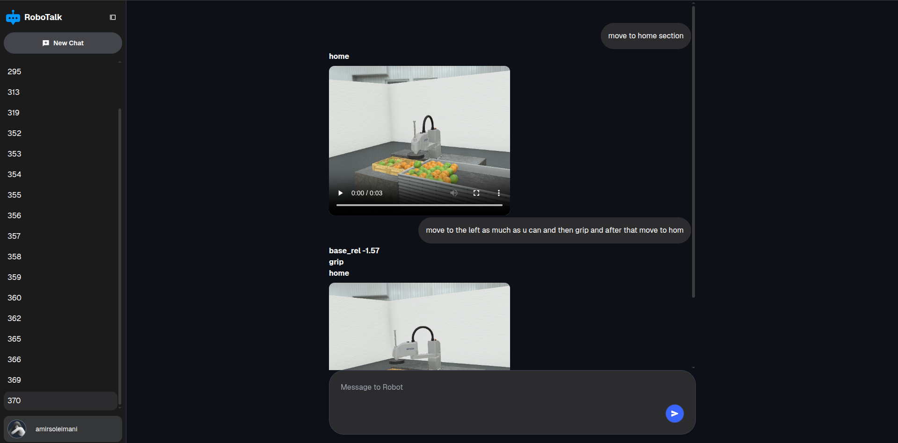
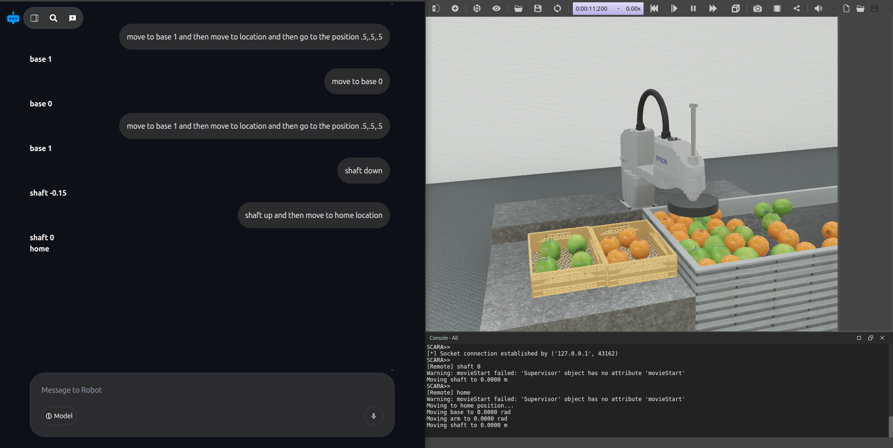
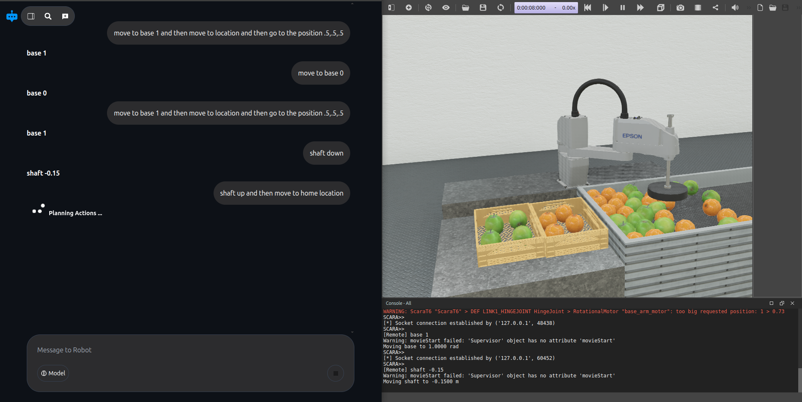
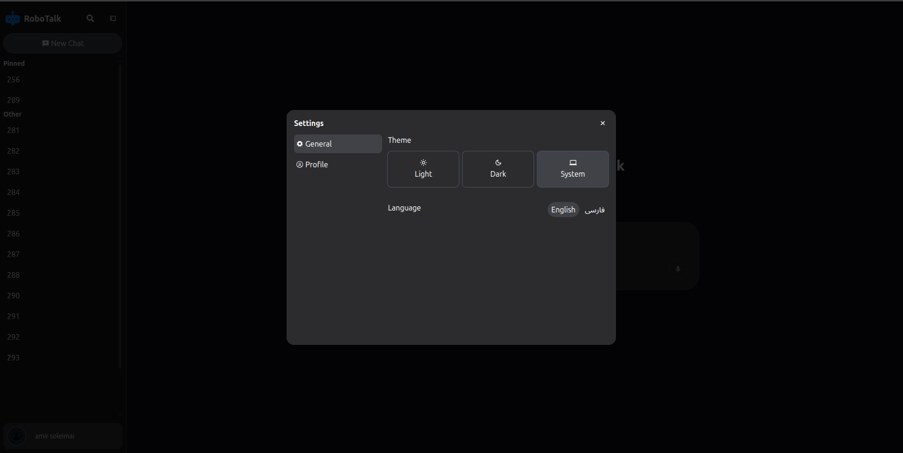
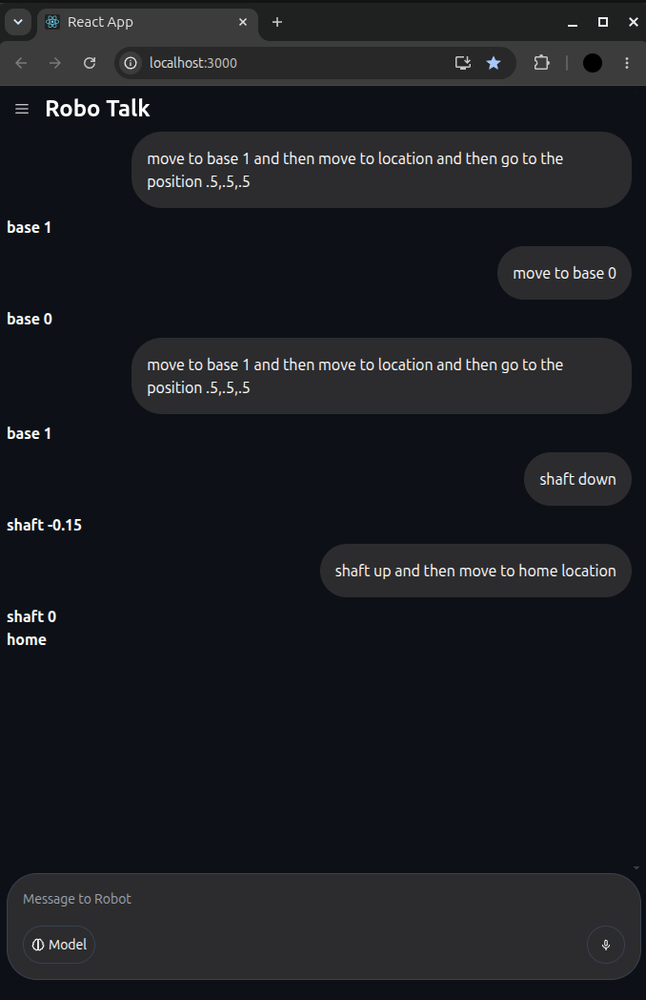
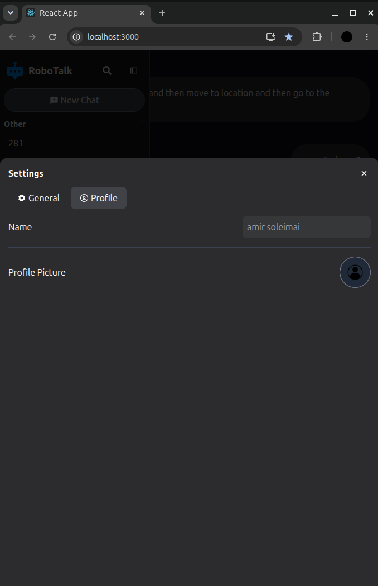

# LLM-Robotics: Natural Language Robot Planning & Control

Using LLM for making multi-step plans for robots with an interactive web interface.

LLM-Robotics is an end-to-end system that converts natural language instructions into executable robot commands, validates them, and executes them in a Webots simulation environment. The system combines a React-based chat interface, a Django backend with LLM inference, and a Webots robot simulator with real-time command execution.

## 🎯 Overview

This project demonstrates how Large Language Models can be used to generate multi-step robot control sequences. Users interact through a chat interface ("RoboTalk") to command a SCARA T6 robotic arm in a simulated food-sorting industrial environment.

**Key Features:**
- **Natural Language Interface**: Chat-based UI for commanding robots
- **LLM-Powered Planning**: Local LLM generates command sequences from user requests
- **Real-Time Validation**: Commands are validated for reachability, joint limits, and syntax
- **Webots Simulation**: Full physics-based robot simulation with video recording
- **Multi-Step Tasks**: Support for complex manipulation tasks (pick, place, move)
- **Chat History**: Persistent conversation management with pinning and archiving
- **Video Recording**: Each robot action is recorded and linked to the conversation

## 📋 System Architecture

### Components

#### 1. **Frontend (React + JavaScript)**
- **Location**: `/client`
- **Port**: 3000 (development)
- A responsive React application ("RoboTalk") with:
  - Main chat area for conversation display
  - Input area for natural language commands
  - Sidebar for conversation management (create, select, delete, pin, unpin)
  - Settings panel for user profile management
  - Mobile-responsive layout
  - Real-time loading states during LLM planning and robot execution

**Key Files:**
- `App.js` - Main application component
- `components/MainArea/` - Chat display and input components
- `components/SideBar/` - Conversation management
- `components/ShowSettings/` - User profile settings

#### 2. **Backend (Django + Django REST Framework)**
- **Location**: `/core`
- **Port**: 8000 (development)
- RESTful API backend handling:
  - User authentication and profile management
  - Conversation CRUD operations
  - Message storage with video references
  - LLM prompt processing and command generation
  - Socket communication with robot simulator

**API Endpoints:**
- `POST /handle_prompt/` - Process natural language input, call LLM, execute on robot
- `GET/POST /conversations/` - Conversation management
- `GET/POST /messages/` - Message history retrieval
- `GET/POST /user/` - User profile management

**Database Models:**
- `User` - User profile with name and avatar
- `Conversation` - Chat session with title and timestamps
- `Message` - Individual messages with sender type and optional video URL

#### 3. **Robot Simulator (Webots + Python)**
- **Location**: `/webots-robot/scara_t6`
- Industrial food-sorting scenario with SCARA T6 robotic arm
- TCP socket server (`127.0.0.1:65432`) for remote command execution
- Physics-based simulation with video recording capabilities

**Key Components:**
- `scara_socket_server.py` - Main controller handling TCP socket communication
- `industrial_example.wbt` - Webots world with robot, conveyor, and fruit objects
- Real-time video recording of each robot action

#### 4. **LLM Engine (Local Transformers)**
- **Location**: `/core/core/utils/create_llm.py`
- Uses Hugging Face Transformers library with local model inference
- Model: Microsoft Phi-3.5-mini-instruct (offline mode)
- Chat history context for multi-turn interactions
- Automatic retry with correction prompts for invalid outputs

## 🚀 How It Works

### Command Flow

```
User Input (Chat UI)
    ↓
Django Backend (/handle_prompt/)
    ↓
LLM Agent (generates command sequence)
    ↓
Command Validator (validates syntax, reachability, joint limits)
    ↓
Socket Client (sends to robot simulator)
    ↓
Webots Controller (executes commands)
    ↓
Robot Action (movement + video recording)
    ↓
Response to Frontend (with video link)
    ↓
Chat Display (shows results)
```

### Supported Robot Commands

**Movement:**
- `move_to x y z` - Move to Cartesian coordinates (with inverse kinematics)
- `move_base angle` - Rotate base joint
- `move_arm angle` - Rotate arm joint
- `move_shaft distance` - Extend/retract shaft

**Manipulation:**
- `pick` - Pick up object with suction cup
- `place` - Release object

**Position Memory:**
- `save_pos name` - Save current robot configuration
- `goto_pos name` - Move to saved configuration
- `list_pos` - List all saved positions
- `delete_pos name` - Delete saved position

**Utilities:**
- `set_speed value` - Set movement speed
- `led on|off` - Control end-effector LED
- `wait seconds` - Pause between commands
- `status` - Display current joint positions
- `verbose on|off` - Toggle debug output

### LLM Command Generation

The LLM generates multi-step command sequences constrained by:
- **System Prompt**: Defines available commands and output format
- **Validation Rules**: 
  - Joint angle limits (base, arm)
  - Shaft extension limits
  - Cartesian reachability based on SCARA link lengths (L1=150mm, L2=150mm)
  - Command syntax and argument count verification
- **Error Recovery**: Invalid outputs trigger automatic retry with correction prompts
- **Command Normalization**: Supports various aliases and formatting styles

### Reachability Validation

For `move_to x y z` commands:
- Checks Z (shaft) is within physical limits
- Validates X, Y are within reachable workspace using SCARA geometry
- Applies link length constraints before sending to inverse kinematics
- Returns error message with valid ranges if out of reach

## 💻 Technology Stack

**Frontend:**
- React.js
- Axios (HTTP client)
- CSS3 with responsive design
- JavaScript (ES6+)

**Backend:**
- Django 4.x
- Django REST Framework
- Hugging Face Transformers (PyTorch)
- Python 3.8+

**Robot Simulation:**
- Webots R2025a
- Python 3.x (Webots controller)
- Socket programming (TCP)

**Database:**
- SQLite (development)

**Languages by Composition:**
- Python: 71.8%
- JavaScript: 25.6%
- CSS: 1.5%
- HTML: 1.1%

## 🛠️ Setup & Installation

### Prerequisites
- Python 3.8+
- Node.js 14+
- Webots R2025a (with SCARA T6 proto files)
- Git

### Backend Setup

```bash
cd core
python -m venv venv
source venv/bin/activate  # On Windows: venv\Scripts\activate
pip install -r requirements.txt
python manage.py migrate
python manage.py runserver
```

### Frontend Setup

```bash
cd client
npm install
npm start
```

The React app will run on `http://localhost:3000`

### Robot Simulator Setup

1. Open Webots
2. Open `/webots-robot/scara_t6/scara_t6/worlds/industrial_example.wbt`
3. Run the simulation
4. The socket server will start automatically and listen on `127.0.0.1:65432`

## 📸 User Interface Screenshots

### Main Chat Interface


The main conversation area showing the chat history with user queries and robot responses. Users can enter natural language commands in the input field at the bottom.

### Side-by-Side View


Full application layout showing the conversation sidebar on the left and the main chat area on the right. Demonstrates the complete UI with all components visible.

### Loading State


The interface during LLM planning and robot command execution. Shows the "Planning Actions..." loading indicator while the system processes the user's request and executes commands on the robot.

### Settings Panel


User profile settings where you can update your name and profile image. Changes are persisted in the backend and reflected across all conversations.

### Mobile View - Chat


Responsive mobile layout showing the chat interface optimized for smaller screens.

### Mobile View - Menu


Mobile view of the sidebar menu for conversation management on mobile devices.

## 🔌 API Usage Examples

### Send Command to Robot

```bash
curl -X POST http://localhost:8000/handle_prompt/ \
  -H "Content-Type: application/json" \
  -d '{
    "conversation_id": 1,
    "prompt": "Pick up the fruit at position 0.3, 0.2, 0.5"
  }'
```

Response:
```json
{
  "success": true,
  "response": "Picking up fruit at coordinates 0.3, 0.2, 0.5. Suction activated.",
  "commands_executed": ["move_to 0.3 0.2 0.5", "pick"],
  "video_url": "/path/to/recorded/video.mp4"
}
```

### Create Conversation

```bash
curl -X POST http://localhost:8000/conversations/ \
  -H "Content-Type: application/json" \
  -d '{
    "title": "Fruit Sorting Task 1"
  }'
```

### Get Conversation History

```bash
curl -X GET http://localhost:8000/conversations/1/messages/
```

## 📝 Example Interactions

### Simple Pick and Place
**User:** "Pick up the apple and move it to the right"
**LLM Output:**
```
move_to 0.2 0.1 0.3
pick
move_to 0.4 0.1 0.3
place
```

### Saved Position Workflow
**User:** "Save this position as home"
**LLM Output:**
```
save_pos home
```

**User:** "Go back to home"
**LLM Output:**
```
goto_pos home
```

### Multi-Step Task
**User:** "Sort the fruits by moving the apple to the left and the orange to the right"
**LLM Output:**
```
move_to 0.2 0.1 0.3
pick
move_to 0.1 0.1 0.3
place
move_to 0.3 0.1 0.3
pick
move_to 0.5 0.1 0.3
place
```

## 🎓 Project Structure

```
llm-robotics/
├── client/                          # React frontend
│   ├── public/
│   ├── src/
│   │   ├── components/
│   │   │   ├── MainArea/           # Chat display
│   │   │   ├── SideBar/            # Conversations
│   │   │   ├── ShowSettings/       # User settings
│   │   │   └── ...
│   │   ├── App.js
│   │   └── index.js
│   └── package.json
│
├── core/                            # Django backend
│   ├── core/
│   │   ├── settings.py
│   │   ├── urls.py
│   │   ├── views.py               # API endpoints
│   │   ├── models.py              # Data models
│   │   ├── utils/
│   │   │   ├── create_llm.py      # LLM initialization
│   │   │   ├── rag_functions.py   # Command validation
│   │   │   └── socket_client.py   # Robot communication
│   │   └── ...
│   ├── manage.py
│   └── requirements.txt
│
├── webots-robot/                    # Robot simulator
│   └── scara_t6/
│       └── scara_t6/
│           ├── worlds/
│           │   └── industrial_example.wbt
│           └── controllers/
│               └── scara_socket_server/
│                   └── scara_socket_server.py
│
└── docs/
    └── appscreens/                  # UI screenshots
```

## 🔍 Key Algorithms

### Inverse Kinematics (SCARA)

The system uses geometric inverse kinematics for the 2-DOF SCARA arm:

```python
def inverse_kinematics(self, x, y, z):
    # Given Cartesian target (x, y, z)
    # Compute joint angles (base, arm) for SCARA links
    # Returns (base_angle, arm_angle) or error
```

### Command Validation Pipeline

1. **Parsing**: Extract function name and arguments from LLM output
2. **Canonicalization**: Normalize command aliases (e.g., `pick_up` → `pick`)
3. **Syntax Check**: Verify argument count and types
4. **Range Check**: Validate values against joint/position limits
5. **Reachability Check**: For Cartesian commands, verify target is reachable
6. **Execution**: Send validated commands to robot socket

### Chat Context Management

- Maintains conversation history with speaker role (user/assistant/robot)
- System prompt injected into LLM context for each turn
- Chat history pruned if token count exceeds model limits
- Allows multi-turn reasoning and context-aware planning

## 🚦 Running the System

### Terminal 1: Start Backend
```bash
cd core
source venv/bin/activate
python manage.py runserver
```

### Terminal 2: Start Frontend
```bash
cd client
npm start
```

### Terminal 3: Run Webots Simulation
```
1. Open Webots
2. Load: webots-robot/scara_t6/scara_t6/worlds/industrial_example.wbt
3. Click Play button to start simulation
```

Then navigate to `http://localhost:3000` and start chatting!

## 🔧 Configuration

### Backend Settings (`core/core/settings.py`)
- `DEBUG` - Enable/disable debug mode
- `ALLOWED_HOSTS` - CORS whitelist
- `DATABASES` - Database configuration
- Robot socket server address: `127.0.0.1:65432`

### LLM Settings (`core/core/utils/create_llm.py`)
- `MODEL_PATH` - Path to local model weights
- `device` - CPU/GPU inference
- `max_tokens` - Generation length limit
- `temperature` - Generation randomness

### Robot Calibration (`webots-robot/scara_t6/.../scara_socket_server.py`)
- `JOINT_LIMITS` - Min/max for each joint
- Link lengths: `L1 = 150mm`, `L2 = 150mm`
- Default speed and acceleration values

## ⚠️ Limitations & Future Work

**Current Limitations:**
- Local LLM may have lower quality than cloud APIs
- Limited to Webots simulation (no real robot hardware integration yet)
- Basic inverse kinematics (2-DOF SCARA only)
- Single robot arm (no multi-robot support)
- Chat history not pruned in long sessions

**Future Enhancements:**
- Integration with real robot hardware via ROS
- Hybrid planning with symbolic task planning
- More sophisticated error recovery
- Multi-robot coordination
- Point cloud perception for object detection
- Trajectory optimization
- Web-based 3D visualization of robot state

## 📄 License

[Add your license here]

## 👤 Author

Amir Soleimani

## 🙏 Acknowledgments

- Webots simulation platform (Cyberbotics)
- Hugging Face Transformers library
- Django and Django REST Framework
- React.js community

## 📞 Support & Contact

For issues, questions, or contributions, please open an issue on the GitHub repository.

---

**Status**: Active Development

Last Updated: 2026
